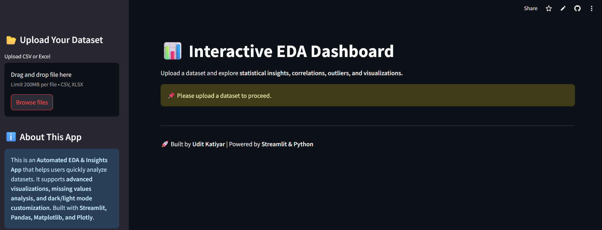
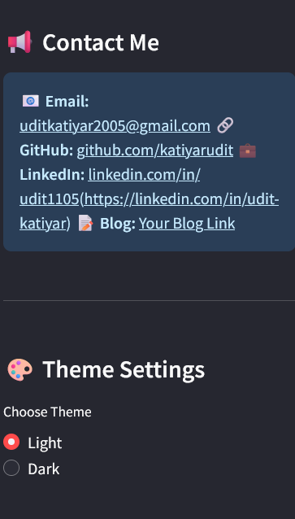
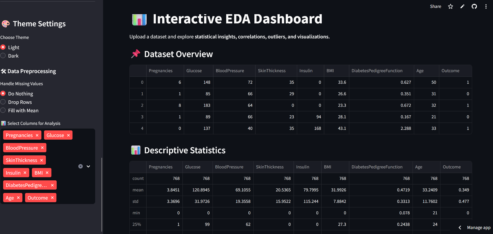
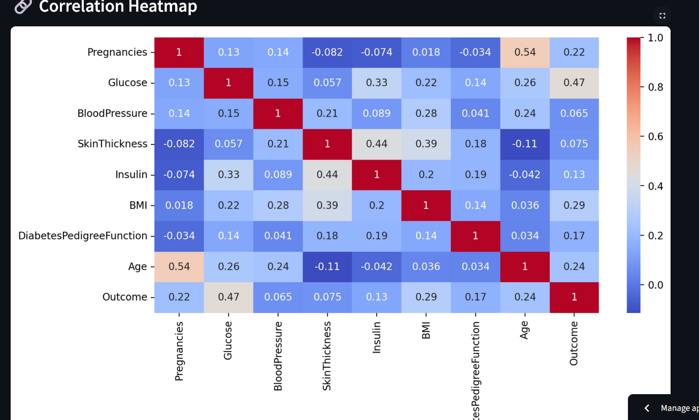
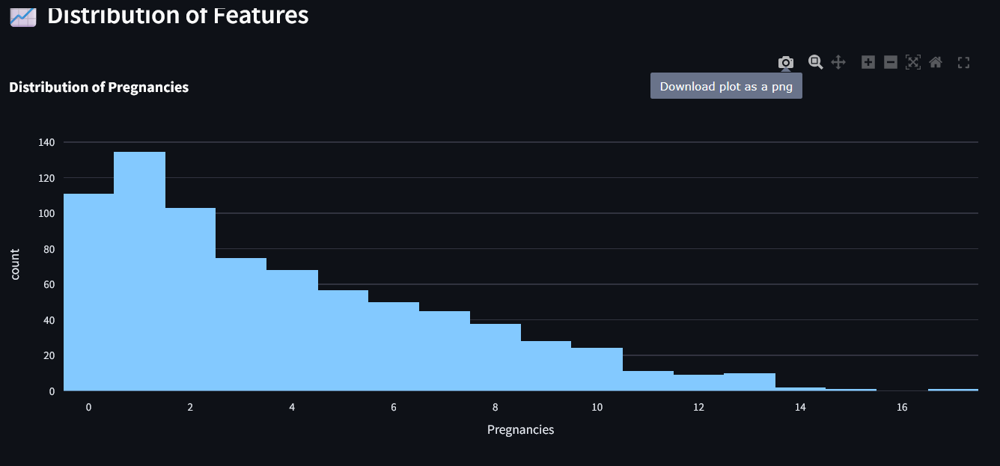
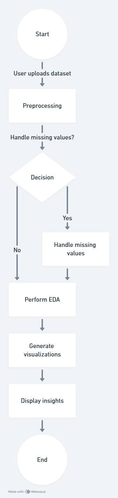

🚀 Smart Data Explorer: AI-Powered EDA & Visualization
https://dataset-ns-ghts-udit.streamlit.app/

📊 "Upload your dataset and uncover powerful insights with interactive charts, AI-driven analysis, and advanced visualizations!"

📌 Table of Contents

    🔹 Demo Images
    🔹 System Architecture
    🔹 Core Components
    🔹 Directory Structure
    🔹 Tech Stack
    🔹 Key Features
    🔹 Prerequisites
    🔹 Setup
    🔹 Development
    🔹 Build
    🔹 About Me
    🔹 Connect With Me

📸 Demo Images
## Main Dashboard!

🏛 System Architecture

Here is the system architecture of the project:
## System Architecture!

## 🔄 System Flowchart  

[📌 View Flowchart on Whimsical](https://whimsical.com/https://whimsical.com/interactive-eda-dashboard-architecture-XfcopuADPsF4z3aJQ8nP6P)  

🔍 Core Components

The project consists of the following main components:

    📂 Data Processing: Reads uploaded datasets and performs cleaning, transformation, and validation.
    📊 EDA Module: Generates statistical insights, correlation matrices, outlier detection, and advanced visualizations.
    🖥️ Interactive UI: Built using Streamlit, featuring a sidebar, light/dark mode, and real-time analytics.
    💾 File Handling: Supports multiple dataset formats like .csv, .xlsx, .json.
    📡 Deployment: Hosted on Streamlit Cloud for easy accessibility.

📁 Directory Structure

📂 Smart-Data-Explorer/
│-- 📄 app.py              # Main Streamlit app  
│-- 📁 pages/              # Additional EDA and Visualization Pages  
│-- 📄 requirements.txt     # Dependencies  
│-- 📁 assets/             # Images, Icons, and Style Files  
│-- 📁 demo/               # Demo Images (for README)  
│-- 📄 README.md           # Project Documentation  
│-- 📄 .gitignore          # Git Ignore File  

💻 Tech Stack

Technology	Purpose
Python	Core Language
Streamlit	UI Framework
Pandas & NumPy	Data Processing
Matplotlib & Seaborn	Data Visualization
Scikit-learn	Feature Engineering
Plotly	Interactive Charts

🌟 Key Features

✅ Upload & Explore: Supports .csv, .xlsx, .json formats

✅ Comprehensive EDA: Statistics, distributions, missing values, outliers

✅ Advanced Visualizations: Correlation heatmaps, box plots, histograms

✅ AI-Driven Insights: Feature importance, correlation suggestions

✅ Interactive Filters: Choose variables, adjust settings, refine analysis

✅ Dark Mode & Sidebar: Personalized user experience

✅ Download Processed Data: Save transformed data for further use

✅ Fast & Lightweight: Runs efficiently on any system

🔧 Prerequisites
Ensure you have Python 3.9+ installed

pip install -r requirements.txt

⚙️ Setup

Clone the repository and install dependencies:
git clone https://github.com/katiyarudit/Dataset_-ns-ghts.git  
cd Dataset_-ns-ghts  
pip install -r requirements.txt  

🛠 Development
To run the project locally, use:

streamlit run app.py

🚀 Build

For production deployment on Streamlit Cloud:

    Push the project to GitHub
    Deploy on Streamlit Cloud

    
👤 About Me

👋 I'm Udit Katiyar, a passionate Machine Learning & Web Developer working on AI-powered solutions and data-driven applications.

📌 Star the repo if you like this project! ⭐
